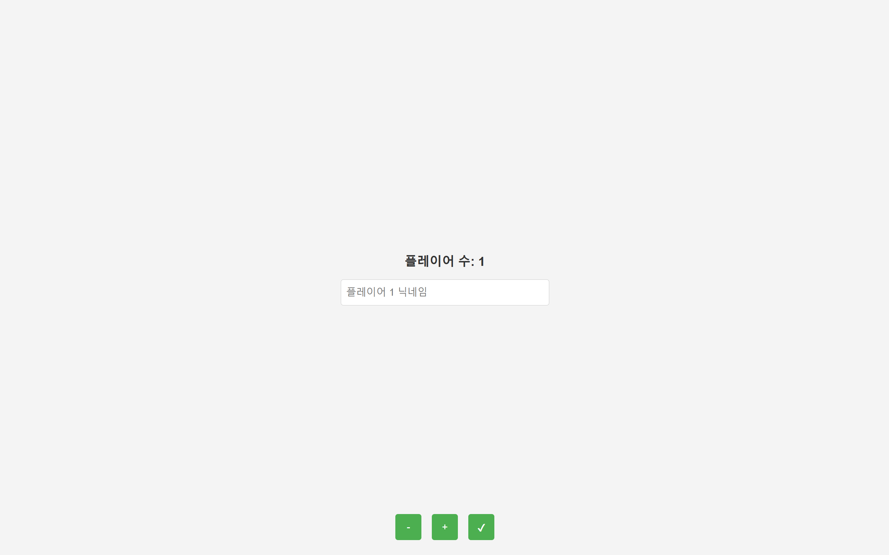
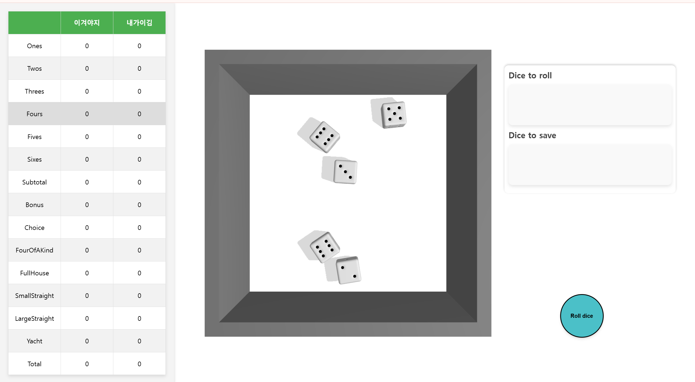
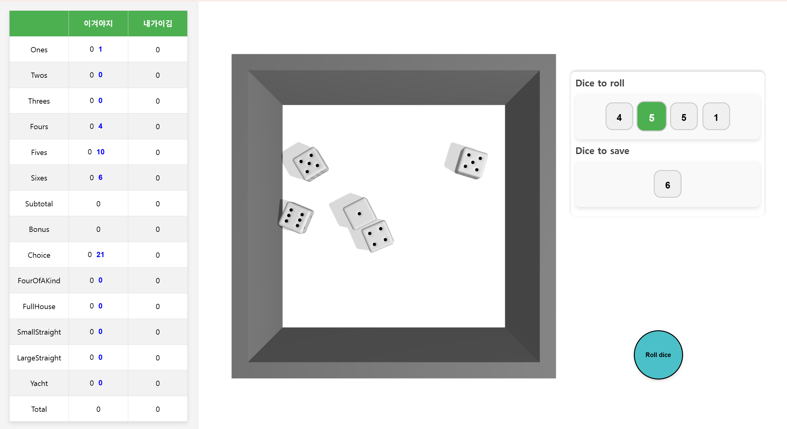
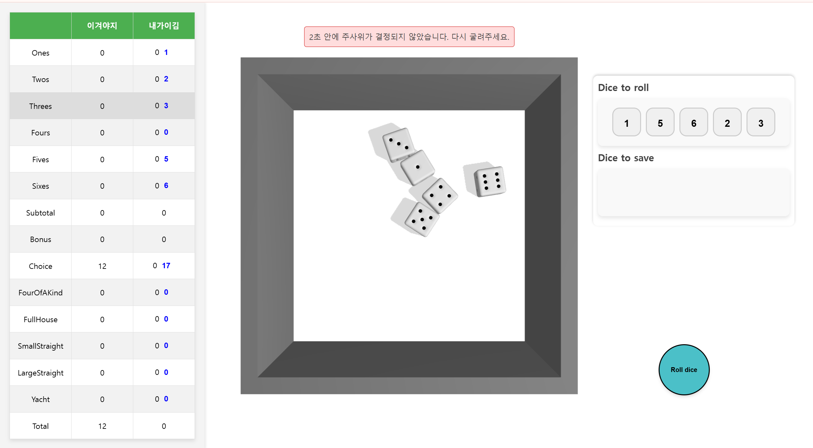

# Yacht-Dice-Web
 - Yacht-Dice-Web은 Yacht게임을 웹에서 즐길 수 있도록 만든 게임입니다.
 - Github Pages로 연동을 해 놓아 [이 링크](https://kim001hs.github.io/Yacht-Dice-Web/)로 바로 플레이 하실 수 있습니다.


## 목차

1.  [실행하기](#실행하기)
2.  [게임 방법](#게임-방법)
    1.  [게임 입장 화면](#게임-입장-화면)
    2.  [게임 시작 화면](#게임-시작-화면)
    3.  [주사위 저장 화면](#주사위-저장-화면)
    4.  [다시 굴리기](#다시-굴리기)
3.  [코드 설명](#코드-설명)
4.  [기술 스택](#기술-스택)
5.  [License](#License)
6.  [Reference](#Reference)


### 실행하기

-   Web Link
    -   https://kim001hs.github.io/Yacht-Dice-Web/

-   로컬 서버 실행
    -  github에서 다운 후 Python 서버, VSCode Live Server 등 로컬 서버로 실행


###  실행 영상

[실행 영상](https://youtu.be/ebhHvrGuSeA)
 

### 게임 방법

#### 게임 입장 화면


시작 전 세팅화면입니다. +와 -버튼을 통해 플레이어 수를 조정할 수 있고 입력란을 통해 닉네임을 설정할 수 있습니다. 
입력을 완료한 후 체크버튼을 누르면 다음 화면으로 넘어갑니다

#### 게임 시작 화면


세팅 후 나오는 기본 화면입니다. 왼쪽에 점수가 나오고 오른쪽 밑의 Roll Dice버튼을 통해 각 턴마다 주사위를 세 번까지 굴릴 수 있습니다. 

#### 주사위 저장 화면


주사위를 한 번 이상 굴리면 나오는 화면입니다. 왼쪽에는 획득 가능한 점수가 나옵니다. 점수를 클릭하면 그 점수가 저장되고 턴이 넘어갑니다.
오른쪽에는 굴릴 주사위와 저장할 주사위가 나옵니다. 클릭을 통해 전환할 수 있습니다.

#### 다시 굴리기


2초안에 주사위의 눈이 결정되지 않았을 시 끼임 등으로 정해지지 않았다고 가정해 주사위를 다시 굴릴 수 있도록 합니다.


### 코드 설명

#### 핵심 코드
```
function Yacht(){
    if(turn==playerCount*12){
        console.log("게임 종료");
        return;
    }
    let i=turn%playerCount+1;
    Dice.updateDiceCount(5);
    saveDice = []; //저장할 주사위
    rollCount=0;
    render();
    rollBtn.disabled = false;
}
async function RollDice() {
    hideMessage();
    Dice.updateDiceCount(5-saveDice.length);
    showPossibleScore=new Player();//임시로 보일 스코어
    Dice.throwDice(); // 주사위 굴리기 함수 호출
    rollBtn.disabled = true; // 버튼 비활성화
    await new Promise(resolve => setTimeout(resolve, 2000));//2초 대기
    if(Dice.diceResult.length!=5-saveDice.length){//2초 후에도 5개가 아니면 겹친거라 간주하고 다시 굴리기 버튼 활성화
        showMessage("2초 안에 주사위가 결정되지 않았습니다. 다시 굴려주세요.");
        rollBtn.disabled = false;
        return;
    }
    rollCount++;
    diceResult = [...Dice.diceResult, ...saveDice];
    nowScore(turn%playerCount+1);//선택할 수 있는 점수 표시
    render();
    if(rollCount<3){//3번까지 굴릴 수 있음
        rollBtn.disabled = false;
    }
}
```
게임을 진행시키는 코드입니다. 새로운 턴마다 Yacht()을 호출하도록 했고 RollDice()를 통해 세번까지 던지기, 2초동안 주사위가 정해지지 않으면 다시 굴리기, nowScore()을 통해 현재 점수 표시, selectScore()을 통해 클릭 및 저장 가능한 점수 표시, render()를 통해 주사위 저장하기 등을 구현했습니다.

#### 변경 권고 코드
```
function increaseCount() {
    if (playerCount === 4) return; // 플레이어 수가 4이면 늘리지 않음
}
```
indes.html의 increaseCount()에서 플레이어 수를 최대 4로 제한했습니다. 수를 변경하면 더 많은 플레이어를 추가할 수 있습니다.

```
async function RollDice() {
    await new Promise(resolve => setTimeout(resolve, 2000));//2초 대기
    if(Dice.diceResult.length!=5-saveDice.length){//2초 후에도 5개가 아니면 겹친거라 간주하고 다시 굴리기 버튼 활성화
        showMessage("2초 안에 주사위가 결정되지 않았습니다. 다시 굴려주세요.");
        rollBtn.disabled = false;
        return;
    }
}
```
test.js의 RollDice()에서 주사위가 끼었다고 판단하는 시간을 2초로 설정했습니다. 이를 변경하여 좀 더 빠른 판단을 하거나 느리지만 다시 주사위를 던지는 비율을 낮출 수 있습니다.

### 기술 스택
    !()[https://www.google.com/url?sa=i&url=https%3A%2F%2Fbrunch.co.kr%2F%40jongmookang%2F6&psig=AOvVaw2NC520GsmSIs94l_b6PfJC&ust=1733832080465000&source=images&cd=vfe&opi=89978449&ved=0CBQQjRxqFwoTCJjxyf3RmooDFQAAAAAdAAAAABAE]


### License
    (MIT License)[https://github.com/kim001hs/Yacht-Dice-Web/blob/main/LICENSE]


### Reference
Third-Party Libraries and Licenses

This project includes code from the following source(s):

- [Threejs-rolling-dice-tutorial](https://github.com/uuuulala/Threejs-rolling-dice-tutorial/tree/master) by [uuuulala], licensed under the MIT License.

##### Notifiable changes that I made
- 주사위 5개를 던지는 게임과 Yacht(야추)의 룰을 결합하여 Yacht을 만들었습니다
- 주사위 수를 변경시키는 함수
- 플레이어 인원을 추가, 감소시키는 기능
- 점수판 표시 및 업데이트 기능
- 저장할 주사위 선택 및 남은 주사위만금 굴리는 기능

##### Limitations
- 턴이 넘어갈수록 렉이 심해집니다(고치기 위해 여러 방법을 시도했지만 결국 고치지 못함..)
- HTML,css,js에 관해 전혀 모르는 상태로 공부를 위해 시작했지만 css부분을 공부 하지 못함 (대부분 chat-gpt를 사용해 해결)
- 게임 종료시 특별한 화면을 추가하고 싶었으나 시간 부족으로 추가하지 못함
- 전혀 모르는 상태에서 three.js, cannon을 사용하다보니 코드수정이 거의 불가능했음(공부를 먼저 하고 시작했으면 좋았겠다)